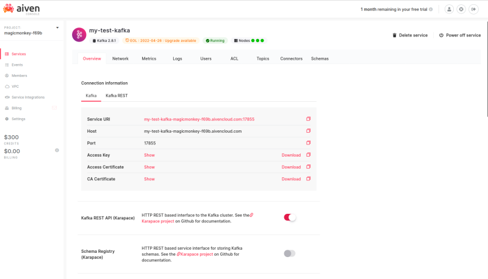
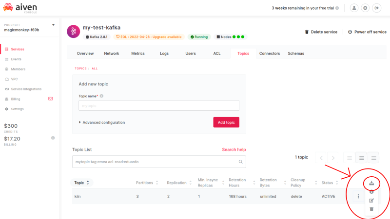
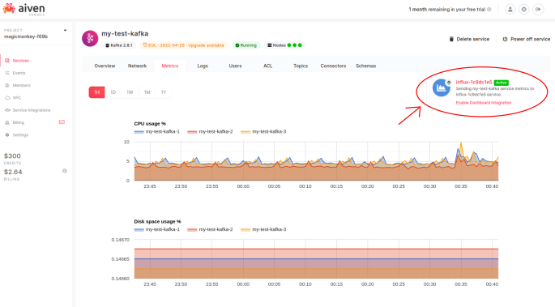
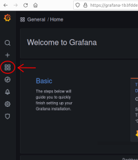
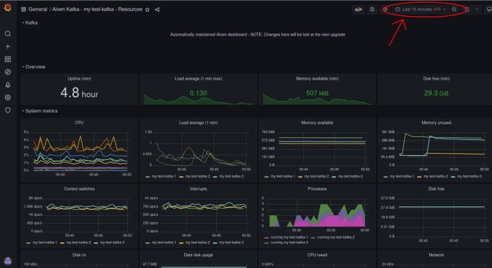

# Working with Aiven for Apache Kafka

Setting-up Aiven for Apache Kafka, with full observability metrics, can be done using either the Aiven web-based console, the Aiven CLI client, or the Aiven terraform provider.  In this article we will walk through setting-up a new Kafka cluster, publishing some sample data onto a topic, and creating a dashboard filled with useful operational data about the cluster.

The sample data will be produced by code written in Go using a standard Kafka client library.  Connecting to Aiven for Apache Kafka can be secured using either TLS client certificates or SASL authentication - this code will use a client certificate, which is the default.

To simulate a typical IoT application (a wood-drying kiln), messages will be produced in JSON format, and will contain:

* two temperature readings
* a humidity reading
* a weight reading

## Create the Kafka cluster

To create the Kafka cluster using the [web console](https://console.aiven.io/), choose "Services" from the navigation and click on "+ Create a new service".  Select Kafka version 2.8, and choose which cloud/region and cluster size you would like - for this example we are using GCP's "europe-west1" region, and the "startup-2" plan as it will not be handling many messages (the plan can be upgraded later if necessary).

After choosing a name (which we will need later, in this case it is "my-test-kafka") and clicking "Create Service" on the right-hand side, it will take a few minutes for the new cluster to be created.  You can watch the progress via the "Current services" screen in the web console, or by using the [CLI client](https://developer.aiven.io/docs/tools/cli).

Once it has been created, to see the details of the new service you can click into it in the web console.  To configure the sample code, take note of the service URI, and the access key / access certificate / CA certificate (which can also be downloaded using the CLI command `avn service user-creds-download --username avnadmin my-test-kafka`).

Be sure to enable the "Kafka REST API (Karapace)" setting, as this is used by the web console to browse messages.

## Create the topic

Choose the "Topics" tab, and add a new topic with the name "kiln".  In the "Advanced configuration" you can override various defaults like the replication factor or the number of partitions, which are important for resilience against the failure of one or more nodes in the Kafka cluster.  Remember that the order of messages is only preserved within a partition, and the partition is selected based on the message key, so choose a key with suitably high cardinality to be useful for partition distribution and that will keep your data intact (e.g. "user ID" can be a good choice because then all messages related to that user will be kept in the correct order, but be careful of enabling compaction in this scenario [insert link to docs]).

## Terraform

As well as setting-up Kafka via the web console, you can also use the Aiven Terraform provider.  There is more info about this on the [Aiven Developer Portal](https://developer.aiven.io/docs/tools/terraform), and an example is in the [Github repo](https://github.com/magicmonkey/aiven-kafka-walkthrough/tree/main/terraform) alongside this article.  To use the Terraform provider, you will need to create a new access token (click on the "User Information" icon in the top-right of the web console, go to the "Authentication" tab, and click the "Generate token" button).

# Sample producer code

In the [Github repo](https://github.com/magicmonkey/aiven-kafka-walkthrough/tree/main/sample-code), you can find code which will send a new "payload" from our imaginary wood-drying kiln once per second.  It needs some configuring so that it knows to send to the right topic on the new Kafka cluster; edit the file `main.go` and fill in the details on lines 25-29.

In order for the web console message browser to display a JSON message, the message key _also_ needs to be formatted as JSON - here there is a single field "id" inside the key's JSON structure.

After letting the code run for a while using `go run .` you will be able to browse the messages on the topic by launching the "Kafka REST" client in the web console (click on the 3-dots menu next to the "kiln" topic, and choose the first icon).  If you chose multiple partitions in your topic, you can see the balance across partitions in the bar chart at the top of this screen.  Underneath the chart is the message browser; change the format to "JSON" and click on "Fetch Messages" to see the most recent messages you published onto the topic.

# Operational metrics

By default, there are some basic metrics visible under the "Metrics" tab on the Kafka service page in the web console, but these are only scratching the surface of the rich set of observability data which is available from Kafka.  To capture this data, you need to enable and join up a couple more Aiven services - InfluxDB to store the detailed metrics, and Grafana to see the metrics in a variety of useful graphs.

Aiven will automatically join all of these services together if you choose to.  From the "Metrics" tab, click the "Enable Metrics Intergration" button on the right-hand side, and create a "New InfluxDB service".  Choose the region (ideally the same as where the Kafka service is) and the plan, then "Create and enable".  Assuming you don't want any other Kafka integrations at the moment, close the next screen and go back to the "Metrics" tab.

You now have your detailed Kafka metrics being sent into an InfluxDB, but so far there isn't a convenient dashboard pre-configured with graphs to visualise the metrics.  Go back to the Kafka service page, and in the "Metrics" tab you'll see that there is an InfluxDB service integration - below this there's a link "Enable Dashboard Integration" which will allow you to create a "New Grafana service".  Choose the same region, and a plan size, and "Create and enable" will start making a new Grafana service with a ready-built dashboard for seeing the Kafka metrics from InfluxDB.

Go back to the "Services" list for your project, and once the Grafana service has finished building you can click into it to see the URL to Grafana, and the username and password to use to login.  Grafana will default to its "Welcome to Grafana" screen after login, but you can find the ready-made dashboard by clicking on the four squares "Dashboards" menu on the left-hand side and choosing "Manage".  There should be an "Aiven Kafka - Resources" dashboard waiting for you.

This dashboard will default to showing you the last 6 hours of data.  As it was only just created, it's best to change it to see the last 15 minutes, using the time window selector at the top.

## The Aiven Kafka Grafana dashboard

You should now be looking at a wealth of metrics, which can initially be somewhat overwhelming.  The dashboard is split into four sections: Overview, System metrics, Kafka metrics, and Java metrics (as Kafka runs on top of the JVM).  There are typically three approaches to keep in mind when looking at a dashboards like this:

1. Get used to how the dashboard looks during the normal "steady-state" operation.  When everything is working as expected, then generally some graphs will be flat, some will have a steady gradient, some will have occasional spikes and then return to normal.  Especially with the overview, being able to glance at a few metrics and know that the system is working as expected is very useful.  Once you have a good idea of what is "normal" then you can use [Grafana's "alerting" capability](https://grafana.com/docs/grafana/latest/alerting/) to have it warn you when things are not normal.

2. Look out for any sudden changes to important graphs, e.g. load average or CPU or free disk space.  These can be indicators that Kafka is doing something unusual, which is often because the applications which are using Kafka have started to behave differently although sometimes it could indicate an issue with Kafka itself.  When you see something unusual, there will often be other graphs which have changed at the same time, which can help to point towards what the actual issue is.

3. Slowly-changing graphs to do with some kind of resource being used up (e.g. free disk space) need to be checked periodically, although these are a prime candidate for alerts.  Make sure that the alerts will trigger with plenty of time to deal with the issue (e.g. moving to a plan with more disk space available, or clearing-out some old data) - predictive alerts which follow the shape of the graph and project it forwards are useful here.  Whilst this is possible with InfluxDB, it is the kind of task which Prometheus' PromQL (available via [Aiven for M3](https://aiven.io/time-series-databases/aiven-for-m3)) is particularly good at.

# Conclusion

Aiven's various services make it quick and easy to setup your own Kafka instance, with observability metrics capture and pre-made dashboard, in a way which your application can use with off-the-shelf libraries.  Aiven's services are all instances of open-source software, making them trivial to integrate with in any tech stack - you don't need to rely on a special library or framework from Aiven.

